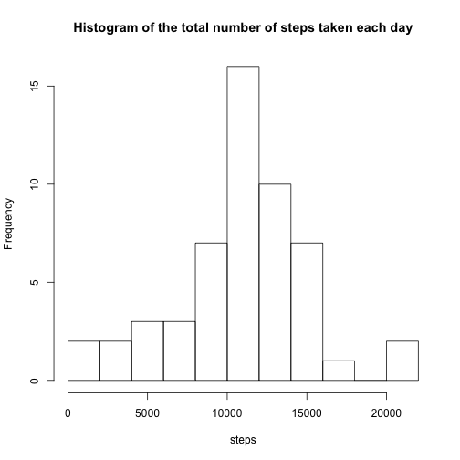
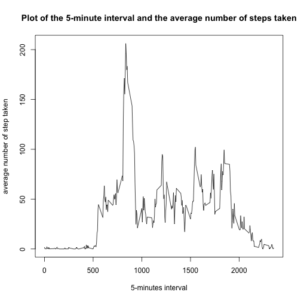
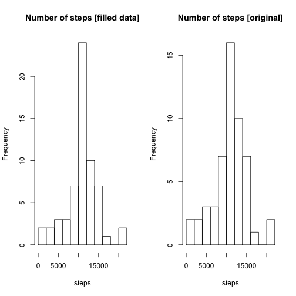
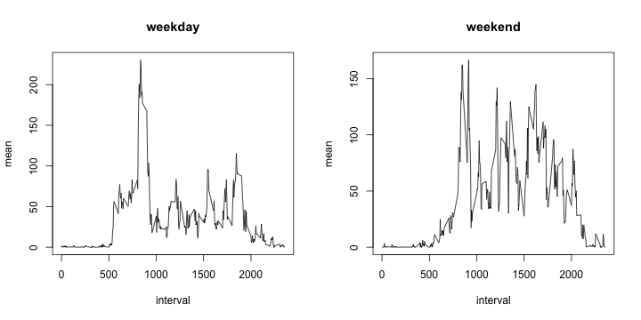

### Loading and preprocessing the data

1. Load the data
2. Process/transform the data (if necessary) into a format suitable for your analysis


```r
data <-read.csv("./activity.csv",header=TRUE,sep=",")
data$date<-as.Date(data$date,"%Y-%m-%d")
head(data)
```

```
##   steps       date interval
## 1    NA 2012-10-01        0
## 2    NA 2012-10-01        5
## 3    NA 2012-10-01       10
## 4    NA 2012-10-01       15
## 5    NA 2012-10-01       20
## 6    NA 2012-10-01       25
```

### What is mean total number of steps taken per day?

1. Make a histogram of the total number of steps taken each day


```r
data_hist<-data %>%
    na.omit(steps) %>%
    group_by (date) %>%
    summarise(sum=sum(steps))

hist(data_hist$sum, breaks = 10, main="Histogram of the total number of steps taken each day",xlab="steps")
```



2. Calculate and report the mean and median of the total number of steps taken per day


```r
mean(data_hist$sum,na.rm=TRUE)
```

```
## [1] 10766.19
```

```r
median(data_hist$sum,na.rm=TRUE)
```

```
## [1] 10765
```

###What is the average daily activity pattern?

1.Make a time series plot of the 5-minute interval (x-axis) and the average number of steps taken, averaged across all days (y-axis)


```r
data_daily<- data %>%
    na.omit(steps) %>%
    group_by(interval) %>%
    summarise(mean=mean(steps))

plot(data_daily,type="l",xlab="5-minutes interval",ylab="average number of step taken",main="Plot of the 5-minute interval and the average number of steps taken")
```



2. Which 5-minute interval, on average across all the days in the dataset, contains the maximum number of steps?


```r
with(data_daily,interval[which(mean==max(mean))])
```

```
## [1] 835
```

###Imputing missing values

1 . Calculate and report the total number of missing values in the dataset (i.e. the total number of rows with NAs)

```r
data_na<-data %>%
    filter(is.na(steps))

dim(data_na)[1]
```

```
## [1] 2304
```

2 . Devise a strategy for filling in all of the missing values in the dataset. The strategy does not need to be sophisticated. <br/>
*Strategy adopted* :  Missing values will be fill with mean for that 5-minute interval. 

3 . Create a new dataset that is equal to the original dataset but with the missing data filled in.


```r
data_fill <- data
index_na<-is.na(data$steps)
data_fill$steps<-replace(data_fill$steps,index_na,data_daily$mean)

head(data_fill)
```

```
##       steps       date interval
## 1 1.7169811 2012-10-01        0
## 2 0.3396226 2012-10-01        5
## 3 0.1320755 2012-10-01       10
## 4 0.1509434 2012-10-01       15
## 5 0.0754717 2012-10-01       20
## 6 2.0943396 2012-10-01       25
```

4 . Make a histogram of the total number of steps taken each day and 
5. Calculate and report the mean and median total number of steps taken per day.

- Do these values differ from the estimates from the first part of the assignment? *Answer : No*
- What is the impact of imputing missing data on the estimates of the total daily number of steps? *Imputing missing data doesn't change distribution and mean but change median because there are more avaiblable data.*


```r
data_hist2<-data_fill %>%
    group_by (date) %>%
    summarise(sum=sum(steps))


par(mfrow=c(1,2))
hist(data_hist2$sum,breaks=10, main="Number of steps [filled data]", xlab="steps")
hist(data_hist$sum, breaks = 10, main="Number of steps [original]", xlab="steps")
```



```r
mean(data_hist2$sum)
```

```
## [1] 10766.19
```

```r
median(data_hist2$sum)
```

```
## [1] 10766.19
```

###Are there differences in activity patterns between weekdays and weekends?

1 . Create a new factor variable in the dataset with two levels -- "weekday" and "weekend" indicating whether a given date is a weekday or weekend day.


```r
weekday=c("Monday","Tuesday","Wednesday","Thursday","Friday")
data_fill$type <-ifelse(weekdays(data_fill$date) %in% weekday,"weekday","weekend") 
```

2 . Make a panel plot containing a time series plot (i.e. type = "l") of the 5-minute interval (x-axis) and the average number of steps taken, averaged across all weekday days or weekend days (y-axis).


```r
data_weekday <- data_fill %>%
    filter(type=="weekday") %>%
    group_by(interval) %>%
    summarise(mean=mean(steps))

data_weekend <- data_fill %>%
    filter(type=="weekend") %>%
    group_by(interval) %>%
    summarise(mean=mean(steps))    

par(mfrow=c(1,2))
with(data_weekday,plot(interval,mean,type="l",main="weekday"))
with(data_weekend,plot(interval,mean,type="l",main="weekend"))
```



###Export Notes
Export on light format with figures folder

library(knitr)  
library(markdown)  
knit("PA1_template.Rmd")  
markdownToHTML("PA1_template.md","PA1_template.html")  
